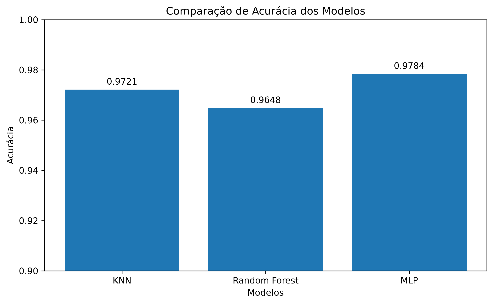
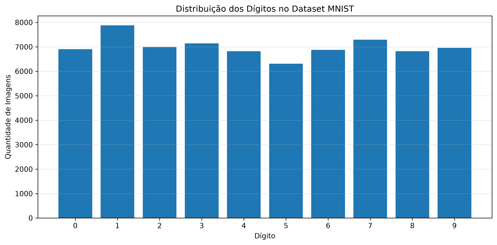
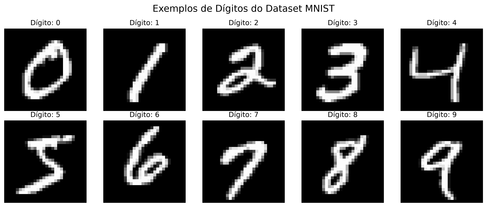
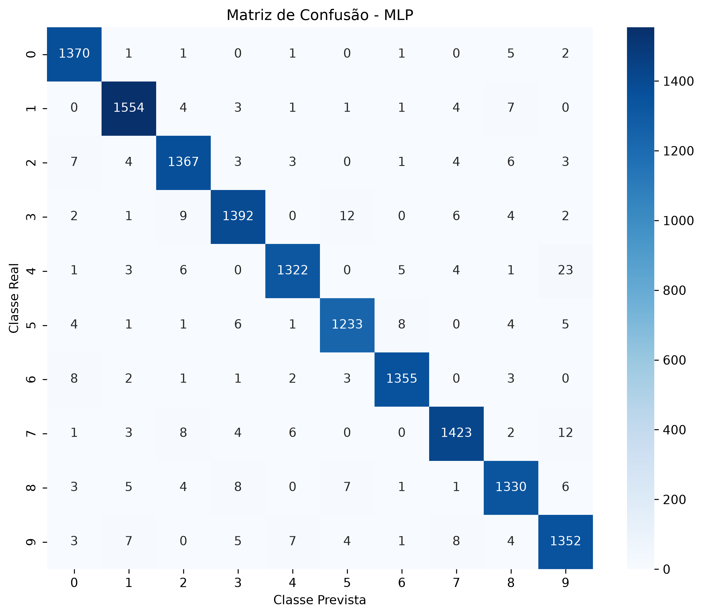
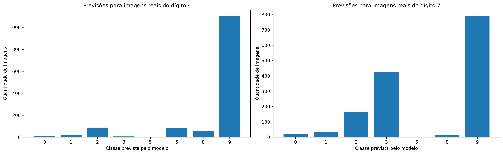
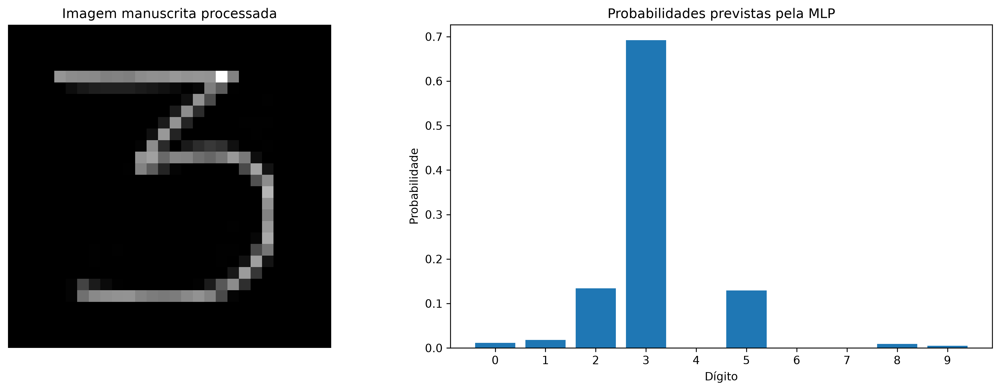

# Mini Projeto MNIST — Classificação de Dígitos Manuscritos

## 📌 Sobre o Projeto

Este projeto apresenta um Pipeline de Ciência de Dados ponta a ponta utilizando Machine Learning para realizar a classificação de dígitos manuscritos do dataset MNIST.

O objetivo é comparar diferentes algoritmos de Machine Learning e identificar qual modelo apresenta o melhor desempenho na classificação dos dígitos de 0 a 9.

Além da comparação dos modelos, o projeto inclui testes de robustez e um desafio de inferência utilizando uma imagem manuscrita própria.

---

# 🎯 Objetivo

Desenvolver e avaliar modelos de Machine Learning capazes de reconhecer dígitos manuscritos.

Os principais objetivos foram:

- Explorar o dataset MNIST;
- Preparar os dados para treinamento;
- Treinar diferentes modelos de Machine Learning;
- Comparar o desempenho dos modelos;
- Avaliar os erros por meio de matrizes de confusão;
- Testar o comportamento do modelo com classes ocultadas;
- Realizar inferência utilizando uma imagem manuscrita própria.

---

# 📊 Dataset

O projeto utiliza o dataset MNIST, composto por imagens manuscritas dos dígitos de 0 a 9.

Cada imagem possui:

- 28 × 28 pixels;
- 784 características após transformação em vetor;
- Valores de pixels utilizados como entrada dos modelos.

---

# 🤖 Modelos Utilizados

Foram treinados e comparados três modelos:

## K-Nearest Neighbors (KNN)

Modelo baseado na proximidade entre os exemplos.

**Acurácia final: 97,21%**

---

## Random Forest

Modelo baseado em múltiplas árvores de decisão.

**Acurácia final: 96,48%**

---

## Multi-Layer Perceptron (MLP)

Rede neural artificial utilizada para classificação dos dígitos.

**Acurácia final: 97,84%**

🏆 O modelo MLP apresentou o melhor desempenho entre os modelos avaliados.

---

# 📈 Comparação dos Modelos



| Modelo | Accuracy |
|---|---:|
| KNN | 0.972143 |
| Random Forest | 0.964786 |
| MLP | 0.978429 |

---

# 🔍 Análise Exploratória

## Distribuição dos Dígitos



## Exemplos do Dataset MNIST



---

# 🧠 Avaliação do Melhor Modelo

A MLP apresentou o melhor desempenho geral durante os testes realizados.

A matriz de confusão foi utilizada para analisar os acertos e os erros de classificação.



A maior confusão identificada ocorreu entre os dígitos:

**4 → 9**

---

# 🔬 Teste de Robustez — Classes Ocultadas

Foi realizado um experimento removendo os dígitos **4 e 7** do conjunto de treinamento.

Dessa forma, o modelo foi treinado sem conhecer essas duas classes.

Posteriormente, foram utilizadas imagens reais dos dígitos 4 e 7 para verificar como o modelo classificaria exemplos pertencentes a classes que não foram apresentadas durante o treinamento.



O experimento demonstrou como um modelo de classificação se comporta quando recebe exemplos de classes que não estavam disponíveis durante o treinamento.

---

# ✍️ Inferência com Imagem Manuscrita Própria

No Desafio C foi utilizada uma imagem manuscrita própria contendo o dígito **3**.

A imagem passou por um pipeline de pré-processamento contendo:

1. Conversão para escala de cinza;
2. Inversão das cores;
3. Identificação da região do dígito;
4. Recorte utilizando bounding box;
5. Redimensionamento mantendo a proporção;
6. Centralização em uma imagem de 28 × 28 pixels;
7. Normalização dos pixels entre 0.0 e 1.0;
8. Transformação em um vetor de 784 características.

A imagem processada foi enviada para o modelo MLP.

O resultado final classificou corretamente o dígito manuscrito como:

# 🎯 Dígito 3

Com aproximadamente:

# ✅ 69,23% de probabilidade



Esse experimento demonstrou a importância do pré-processamento das imagens para aproximar dados do mundo real do padrão utilizado durante o treinamento.

---

# 🛠️ Tecnologias Utilizadas

- Python
- NumPy
- Pandas
- Matplotlib
- Seaborn
- Scikit-learn
- Pillow
- Jupyter Notebook
- Visual Studio Code
- Git
- GitHub

---

# 📁 Estrutura do Projeto

```text
MiniProjeto_MNIST/
│
├── data/
│
├── graficos/
│   ├── classes_ocultadas.png
│   ├── comparacao_modelos.png
│   ├── distribuicao_digitos.png
│   ├── exemplos_digitos_mnist.png
│   ├── imagem_manuscrita_probabilidades.png
│   └── matriz_confusao_mlp.png
│
├── imagens_proprias/
│   ├── digito_3.jpeg
│   ├── digito_4.jpeg
│   └── digito_7.jpeg
│
├── projeto_minist.ipynb
├── README.md
└── requirements.txt 